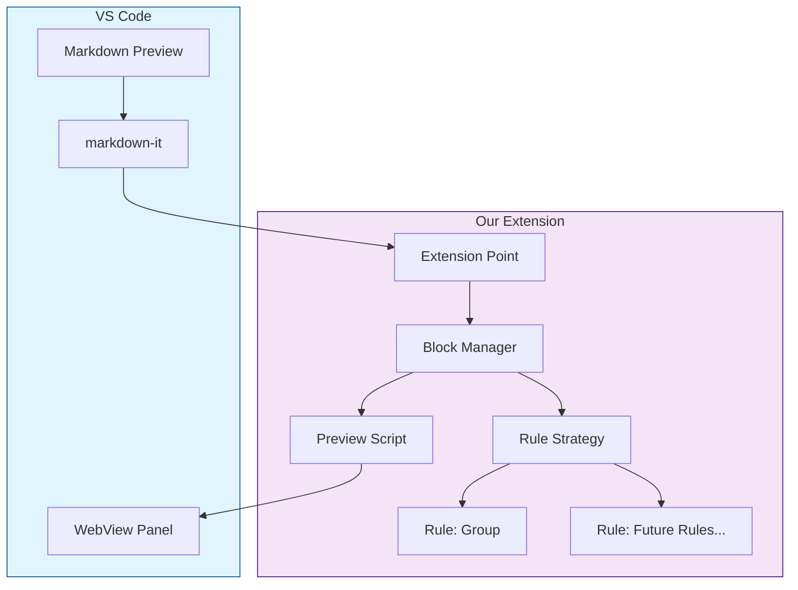
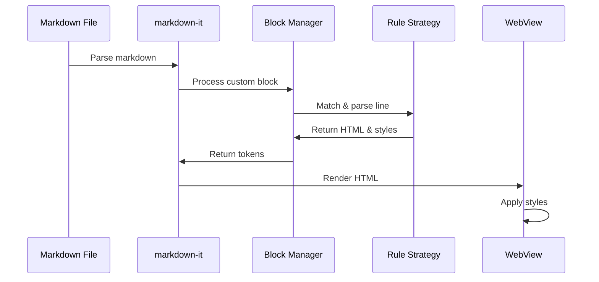
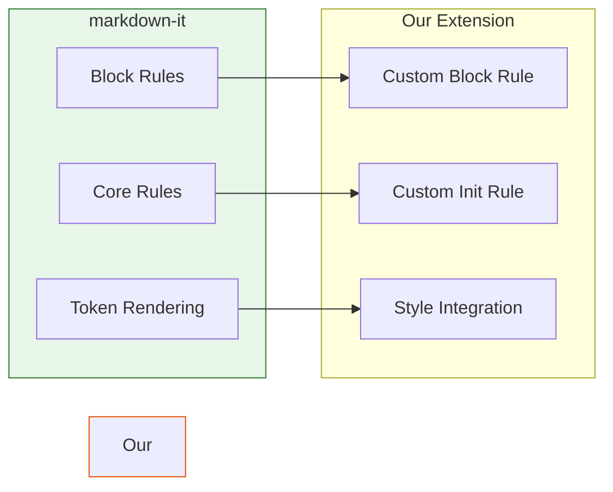
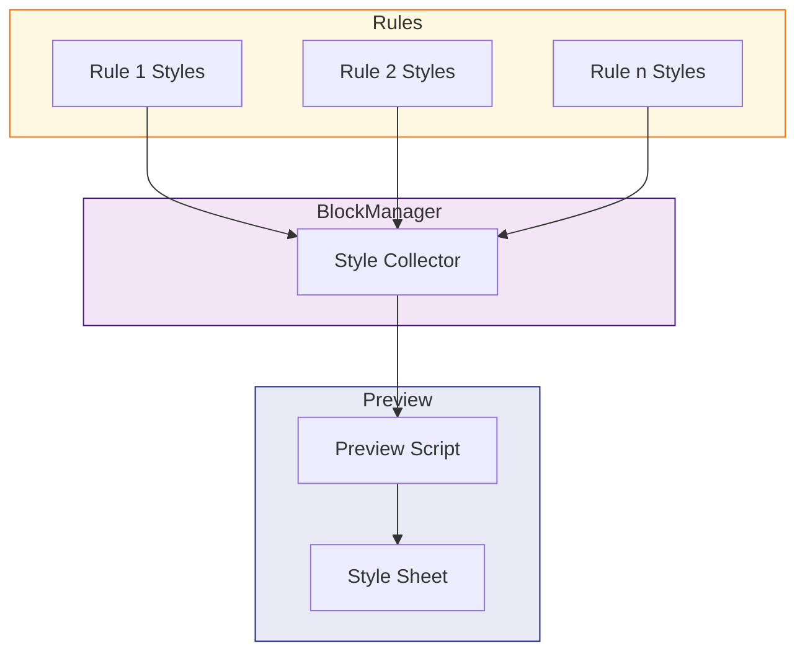
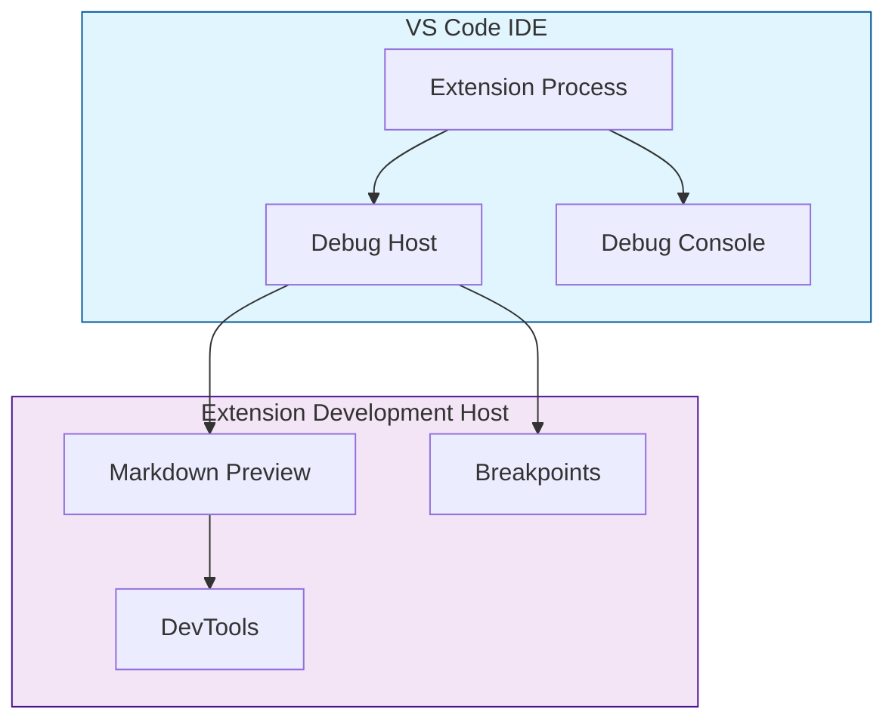
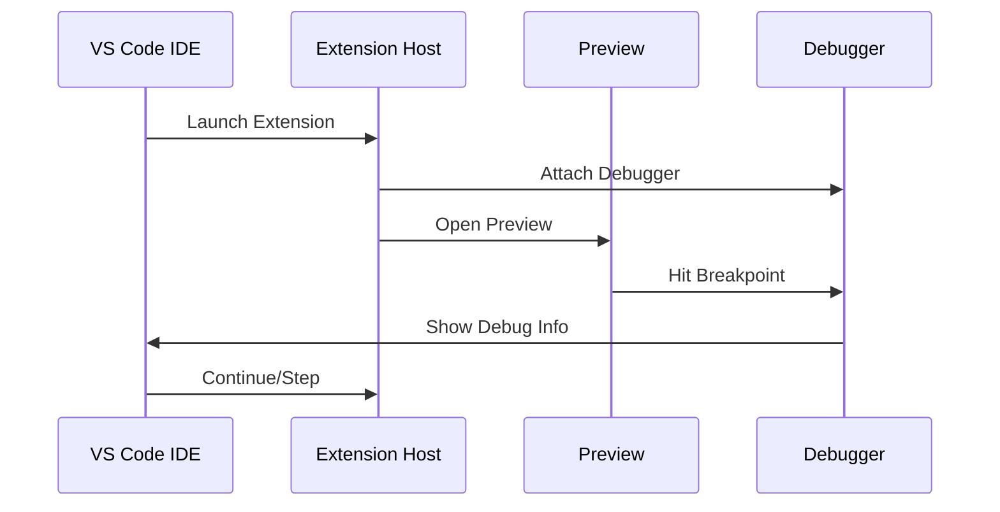

# VS Code Markdown Preview Enhancement Extension

## Overview
This extension enhances VS Code's built-in Markdown preview by adding support for custom diagram blocks using a simple syntax and modular rule system.

## Architecture

### System Components


### Rule Processing Flow


### Markdown-it Integration Details

VS Code's Markdown Preview uses markdown-it as its core markdown parser. Our extension hooks into this system through several key points:

1. **Extension Points**


2. **Integration Methods**
   - **Block Rules**: We insert our custom block rule before the 'fence' rule
   ```javascript
   md.block.ruler.before('fence', 'custom_block', (state, startLine, endLine, silent) => {
       // Process custom blocks
   });
   ```
   
   - **Core Rules**: We initialize our environment before block processing
   ```javascript
   md.core.ruler.before('block', 'custom_block_init', state => {
       state.env.inCustomBlock = false;
   });
   ```

   - **Token Generation**: We create HTML tokens for rendering
   ```javascript
   const token = state.push('html_block', '', 0);
   token.content = '<div class="custom-diagram-block">\n';
   ```

### Component Responsibilities

1. **VS Code Components**
   - `Markdown Preview`: Handles markdown rendering in VS Code
   - `markdown-it`: Core markdown parsing engine
   - `WebView Panel`: Displays rendered content

2. **Extension Components**
   - `Block Manager`: 
     - Coordinates rule processing
     - Manages block state
     - Collects styles
   ```javascript
   class CustomBlockManager {
       processLine(line) { /* ... */ }
       handleBlockStart(state, startLine) { /* ... */ }
       handleBlockEnd(state, startLine) { /* ... */ }
       getAllStyles() { /* ... */ }
   }
   ```

   - `Rule Strategy`:
     - Defines rule interface
     - Handles pattern matching
     - Manages rule-specific styling
   ```javascript
   class RuleStrategy {
       matches(line) { /* ... */ }
       parse(line) { /* ... */ }
       render(content) { /* ... */ }
       getStyles() { /* ... */ }
   }
   ```

### Dynamic Style System


## Custom Syntax

### Block Markers
- `# DIAGRAM_BEGIN`: Starts a custom diagram block
- `# DIAGRAM_END`: Ends a custom diagram block

### section Elements
Inside a custom block, use:
```markdown
section "Your Text Here"
```

## Implementation Details

### Extension Structure
- `extension.js`: Main extension code
  - Registers markdown-it plugin
  - Handles custom block parsing
  - Manages block state
- `media/preview.js`: Preview script
  - Adds custom styles
  - Monitors for block elements

### Markdown-it Integration
The extension uses markdown-it's block rule system to:
1. Detect custom block markers
2. Parse section elements
3. Generate HTML with appropriate classes

### CSS Classes
- `.custom-diagram-block`: Container for the entire block
- `.diagram-section`: Individual section container
- `.diagram-section-content`: section text content

## Adding New Rules

1. Create rule directory:
   ```bash
   mkdir -p rules/new-rule
   ```

2. Implement rule strategy:
   ```javascript
   class NewRuleStrategy extends RuleStrategy {
       matches(line) { /* ... */ }
       parse(line) { /* ... */ }
       render(content) { /* ... */ }
       getStyles() { /* ... */ }
   }
   ```

3. Register in extension:
   ```javascript
   blockManager.addRule(new NewRuleStrategy());
   ```

## Example Usage
```markdown
# DIAGRAM_BEGIN
section "Component A"
section "Component B"
# DIAGRAM_END
```

Renders as:
```html
<div class="diagram-block">
  <div class="diagram-section"><div class="diagram-section-content">Component A</div></div>
  <div class="diagram-section"><div class="diagram-section-content">Component B</div></div>
</div>
```

## Debugging Guide

### Debug Architecture


### Debug Flow


### Debugging Components

1. **Extension Process**
   ```mermaid
   graph LR
       A[Extension Entry] --> B{Activation}
       B -->|Success| C[Rule Processing]
       B -->|Failure| D[Debug Console]
       C --> E[Token Generation]
       E --> F[Preview Rendering]
   ```

2. **Debug Points**
   - **Extension Activation**:
     ```javascript
     function activate(context) {
         // Breakpoint 1: Extension startup
         debugger;
         // Watch for extension initialization
     }
     ```

   - **Rule Processing**:
     ```javascript
     class CustomBlockManager {
         processLine(line) {
             // Breakpoint 2: Line processing
             debugger;
             // Watch for line content and rule matching
         }
     }
     ```

   - **Token Generation**:
     ```javascript
     handleBlockStart(state, startLine) {
         // Breakpoint 3: Token creation
         debugger;
         // Watch token properties and HTML generation
     }
     ```

   - **Style Application**:
     ```javascript
     getAllStyles() {
         // Breakpoint 4: Style collection
         debugger;
         // Watch style aggregation from rules
     }
     ```

### Debug Configurations

1. **launch.json**:
   ```json
   {
       "version": "0.2.0",
       "configurations": [
           {
               "name": "Run Extension",
               "type": "extensionHost",
               "request": "launch",
               "args": [
                   "--extensionDevelopmentPath=${workspaceFolder}"
               ]
           },
           {
               "name": "Extension Tests",
               "type": "extensionHost",
               "request": "launch",
               "args": [
                   "--extensionDevelopmentPath=${workspaceFolder}",
                   "--extensionTestsPath=${workspaceFolder}/test/suite/index"
               ]
           }
       ]
   }
   ```

2. **Debug Console Filters**:
   ```javascript
   // Enable specific debug areas
   const DEBUG = {
       rules: true,
       tokens: true,
       styles: true
   };

   // Usage in code
   if (DEBUG.rules) {
       console.log('Rule matching:', line);
   }
   ```

### Common Debug Scenarios

1. **Rule Matching Issues**
   ```mermaid
   graph TD
       A[Rule Not Matching] --> B{Check Pattern}
       B -->|Invalid| C[Fix Regex]
       B -->|Valid| D[Check Input]
       D --> E[Verify Line Content]
       E --> F[Check Whitespace]
   ```

2. **Style Application Issues**
   ```mermaid
   graph TD
       A[Styles Not Applied] --> B{Check Steps}
       B -->|1| C[Rule getStyles]
       B -->|2| D[BlockManager Collection]
       B -->|3| E[Preview Script]
       B -->|4| F[DevTools Inspection]
   ```

3. **Token Generation Issues**
   ```mermaid
   graph TD
       A[Token Problems] --> B{Verify}
       B -->|Content| C[HTML Structure]
       B -->|State| D[Block Status]
       B -->|Position| E[Line Numbers]
   ```

### Debugging Best Practices

1. **Logging Strategy**
   - Use descriptive log messages
   - Include relevant data context
   - Categorize log types
   ```javascript
   console.log('[Rule]', { line, match, result });
   console.log('[Token]', { type, content, map });
   console.log('[Style]', { rule, css });
   ```

2. **Breakpoint Placement**
   - Strategic points in code flow
   - Data transformation points
   - State change locations

3. **State Inspection**
   - Watch variables for changes
   - Monitor block state transitions
   - Track token generation

4. **Preview Debugging**
   - Use DevTools Elements panel
   - Inspect generated HTML
   - Verify style application 