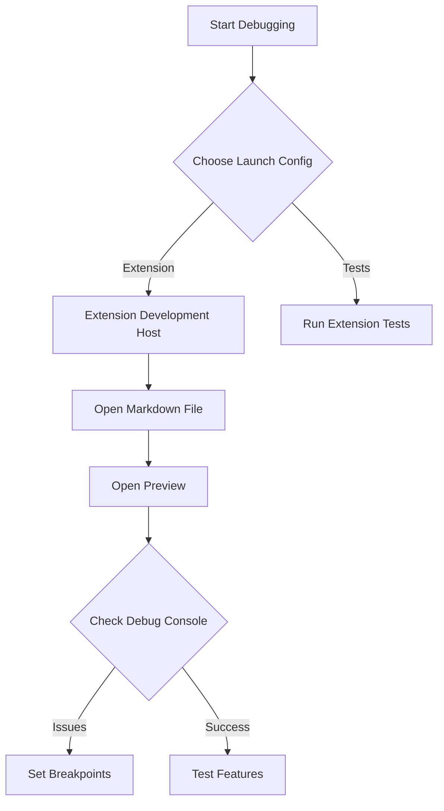
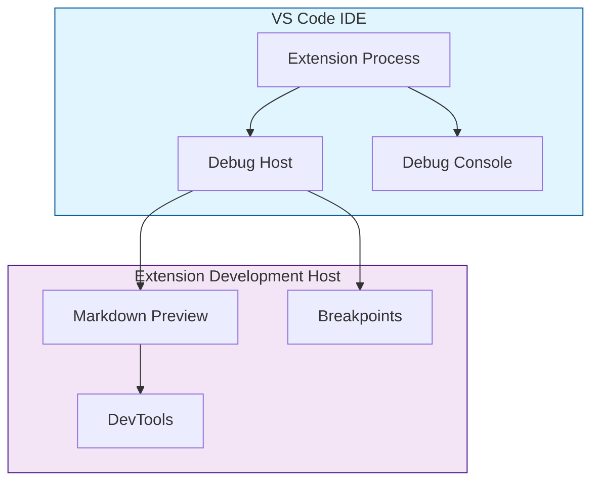
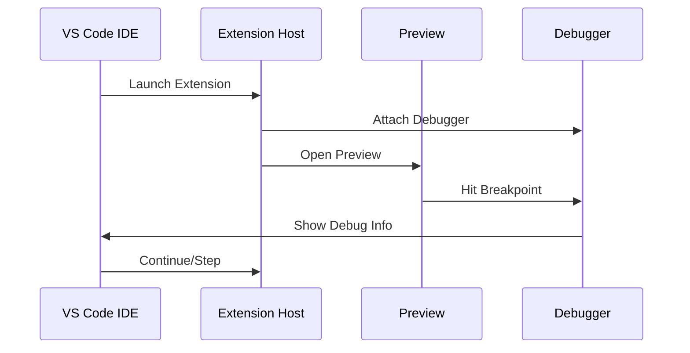

# Development Guide

## Setup
1. Clone the repository
2. Run `npm install`
3. Open the project in VS Code

## Debugging Guide



### Launch Configurations
1. **Extension Development Host**:
   - Press F5 or select "Run Extension" from debug menu
   - Opens new VS Code window with extension loaded
   - Perfect for testing live changes

2. **Extension Tests**:
   - Select "Extension Tests" configuration
   - Runs test suite with debugger attached
   - Use for debugging test failures

### Debug Architecture


### Debug Flow


### Debugging Steps
1. **Set Up Debug Environment**:
   ```bash
   # Terminal 1: Watch for changes
   npm run watch
   ```

2. **Start Debugging**:
   - Press F5 in VS Code
   - Wait for Extension Development Host to open
   - Check Debug Console for extension activation message

3. **Add Debug Points**:
   - In `extension.js`:
     ```javascript
     // Example debug points
     console.log('Processing line:', line);
     debugger; // Add breakpoint here
     ```
   - In rule implementations:
     ```javascript
     matches(line) {
         console.log('Matching line:', line);
         debugger; // Add breakpoint for rule matching
         return line.match(/your pattern/);
     }
     ```

4. **Test Scenarios**:
   ```markdown
   # Test different block combinations
   # DIAGRAM_BEGIN
   section "Test Group"
   # DIAGRAM_END
   ```

### Debug Points
1. **Extension Process**
   ```mermaid
   graph LR
       A[Extension Entry] --> B{Activation}
       B -->|Success| C[Rule Processing]
       B -->|Failure| D[Debug Console]
       C --> E[Token Generation]
       E --> F[Preview Rendering]
   ```

2. **Key Breakpoint Locations**:
   - **Extension Activation**:
     ```javascript
     function activate(context) {
         // Breakpoint 1: Extension startup
         debugger;
         // Watch for extension initialization
     }
     ```

   - **Rule Processing**:
     ```javascript
     class CustomBlockManager {
         processLine(line) {
             // Breakpoint 2: Line processing
             debugger;
             // Watch for line content and rule matching
         }
     }
     ```

   - **Token Generation**:
     ```javascript
     handleBlockStart(state, startLine) {
         // Breakpoint 3: Token creation
         debugger;
         // Watch token properties and HTML generation
     }
     ```

   - **Style Application**:
     ```javascript
     getAllStyles() {
         // Breakpoint 4: Style collection
         debugger;
         // Watch style aggregation from rules
     }
     ```

### Common Debug Scenarios

1. **Rule Matching Issues**
   ```mermaid
   graph TD
       A[Rule Not Matching] --> B{Check Pattern}
       B -->|Invalid| C[Fix Regex]
       B -->|Valid| D[Check Input]
       D --> E[Verify Line Content]
       E --> F[Check Whitespace]
   ```

2. **Style Application Issues**
   ```mermaid
   graph TD
       A[Styles Not Applied] --> B{Check Steps}
       B -->|1| C[Rule getStyles]
       B -->|2| D[BlockManager Collection]
       B -->|3| E[Preview Script]
       B -->|4| F[DevTools Inspection]
   ```

3. **Token Generation Issues**
   ```mermaid
   graph TD
       A[Token Problems] --> B{Verify}
       B -->|Content| C[HTML Structure]
       B -->|State| D[Block Status]
       B -->|Position| E[Line Numbers]
   ```

### Troubleshooting Tips
1. **Preview Not Updating**:
   - Check Debug Console for errors
   - Use "Refresh Markdown Preview Enhancement" command
   - Verify extension activation events

2. **Rule Not Matching**:
   - Enable debug logging in rule strategy
   - Check line content and regex patterns
   - Verify rule registration

3. **Styles Not Applied**:
   - Inspect preview HTML in DevTools
   - Check style collection in BlockManager
   - Verify preview script loading

4. **Extension Not Loading**:
   - Check activation events in package.json
   - Verify extension entry point
   - Look for startup errors in Debug Console

### Best Practices

1. **Logging Strategy**
   - Use descriptive log messages
   - Include relevant data context
   - Categorize log types
   ```javascript
   console.log('[Rule]', { line, match, result });
   console.log('[Token]', { type, content, map });
   console.log('[Style]', { rule, css });
   ```

2. **Breakpoint Placement**
   - Strategic points in code flow
   - Data transformation points
   - State change locations

3. **State Inspection**
   - Watch variables for changes
   - Monitor block state transitions
   - Track token generation

4. **Preview Debugging**
   - Use DevTools Elements panel
   - Inspect generated HTML
   - Verify style application 