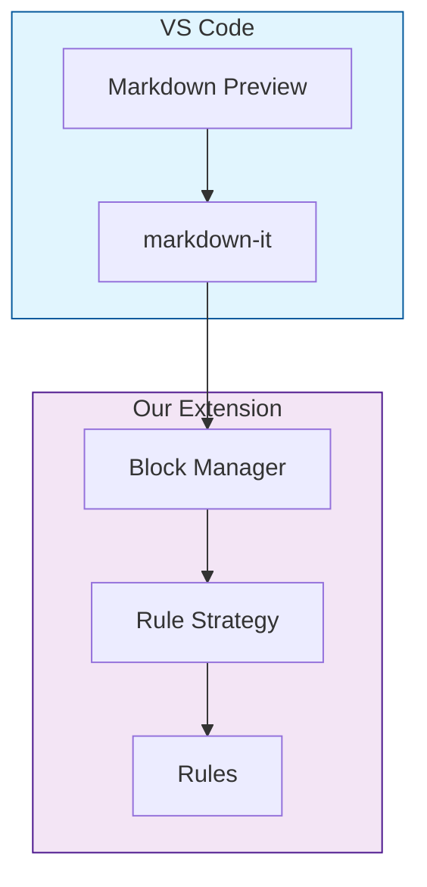
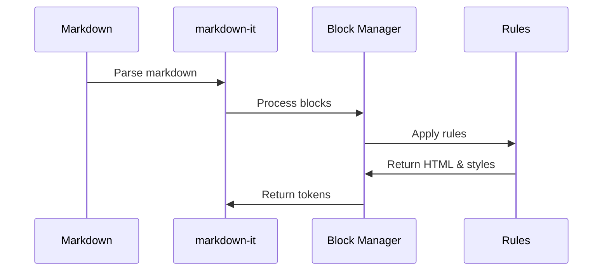

# Markdown Preview Enhancer

A Visual Studio Code extension that enhances the built-in Markdown preview with custom diagram syntax support.

## Features

- Custom diagram blocks with styled containers
- Group syntax for organizing content
- Seamless integration with VS Code's built-in Markdown preview
- Modular rule system for easy extension
- Dynamic styling per rule

## Architecture

### System Overview


### How It Works


## Usage

### Custom Diagram Blocks

Create custom diagram blocks using the following syntax:

```markdown
# CD_BEGIN
group "Your Group Name"
# CD_END
```

You can have multiple groups within a block:

```markdown
# CD_BEGIN
group "Frontend"
group "Backend"
group "Database"
# CD_END
```

### Preview Your Markdown

1. Open your markdown file
2. Press `Cmd+Shift+V` (Mac) or `Ctrl+Shift+V` (Windows/Linux) to open the preview
3. Your custom blocks will be rendered with special styling

### Refresh Preview

If needed, you can manually refresh the preview:
1. Open the Command Palette (`Cmd+Shift+P` or `Ctrl+Shift+P`)
2. Run "Refresh Markdown Preview Enhancement"

## Project Structure

```
project/
├── rules/              # Individual rule implementations
│   └── group/         # Example group rule
│       └── index.js   # Rule implementation with its styles
├── strategies/        # Base strategy classes
│   └── index.js      # RuleStrategy base class
├── managers/         # Rule management
│   └── BlockManager.js # Handles rules and block processing
└── media/           # Preview-related files
    └── preview.js   # Preview script with dynamic styles
```

## Extending the Extension

### Creating a New Rule

1. Create a new directory under `rules/` for your rule:
```bash
mkdir -p rules/your-rule
```

2. Create an implementation file (`rules/your-rule/index.js`):
```javascript
const { RuleStrategy } = require('../../strategies');

class YourRuleStrategy extends RuleStrategy {
    constructor() {
        super('your-rule', null, null);
    }

    matches(line) {
        return line.match(/your pattern/);
    }

    parse(line) {
        const match = line.match(/your pattern/);
        return match ? match[1] : null;
    }

    render(content) {
        return `<div class="your-class">${content}</div>`;
    }

    getStyles() {
        return `
            .your-class {
                /* Your CSS rules */
            }
        `;
    }
}

module.exports = YourRuleStrategy;
```

3. Register your rule in `extension.js`:
```javascript
const YourRuleStrategy = require('./rules/your-rule');
// ...
blockManager.addRule(new YourRuleStrategy());
```

### Rule Strategy Interface

The `RuleStrategy` base class provides:
- `matches(line)`: Determines if the line matches this rule
- `parse(line)`: Extracts content from the line
- `render(content)`: Renders HTML for the content
- `getStyles()`: Returns CSS styles for this rule

### Block Manager

The `CustomBlockManager` handles:
- Rule registration and management
- Block state tracking
- Token generation for markdown-it
- Style collection from all rules

## Example

```markdown
# System Architecture

Here's our system layout:

# CD_BEGIN
group "User Interface"
group "API Gateway"
group "Database"
# CD_END

Regular markdown content continues here...
```

## Installation

1. Download the `.vsix` file from the releases
2. In VS Code, open the Command Palette
3. Run "Install from VSIX..." and select the downloaded file

## Development

For detailed development and debugging guidelines, please refer to [DEVELOPMENT.md](DEVELOPMENT.md).

## License

MIT 